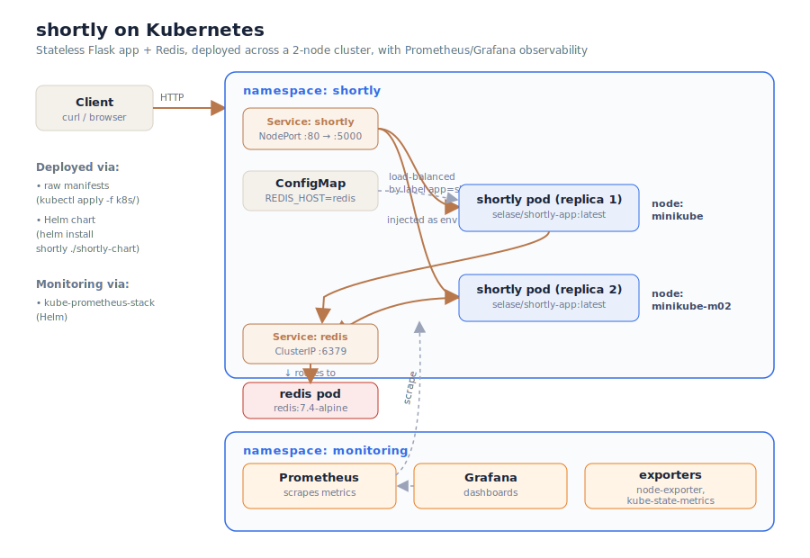

# shortly-k8s


Kubernetes deployment for the **shortly** URL shortener — **Project B** of a
three-part DevOps portfolio series. This repository takes the containerised
application from Project A and runs it as a horizontally-scaled, observable
service on a multi-node Kubernetes cluster.

> **Portfolio series:**
> **A — [shortly-app](https://github.com/Selase17/shortly-app):** the Flask service, containerised, with full CI/CD and a published image.
> **B — `shortly-k8s`** (this repo): Kubernetes deployment — raw manifests, a Helm chart, and Prometheus/Grafana observability.
> **C — `shortly-infra`** *(planned):* the underlying cloud infrastructure provisioned with Terraform.

---

## What this is

Project A proved the app could be built, tested, containerised, and published.
This project proves it can be **run properly** — deployed as multiple stateless
replicas behind a load-balancing Service, backed by shared Redis state, with
health probes, resource limits, and full metrics observability.

The work is deliberately layered at three levels of maturity:

1. **Raw manifests** (`k8s/`) — hand-written Kubernetes YAML. Written first, to
   understand the primitives.
2. **Helm chart** (`shortly-chart/`) — the same deployment packaged as a
   configurable chart, installable with one command.
3. **Observability** (`monitoring/`) — the `kube-prometheus-stack` deployed via
   Helm, providing Prometheus metrics and Grafana dashboards for the cluster.

---

## Architecture



A request flows from the client to the `shortly` **Service** (NodePort), which
load-balances across two stateless app **replicas** scheduled on different
nodes. Both replicas read and write the same **Redis** instance (reached by the
`redis` Service name via cluster DNS), so a short code created by one replica is
resolvable by the other. Redis connection details are injected into the app from
a **ConfigMap** as environment variables. A separate `monitoring` namespace runs
Prometheus (scraping cluster metrics) and Grafana (dashboards).

The key property this demonstrates: **the app is stateless, the state is
external and shared.** That is what makes horizontal scaling on Kubernetes work.

---

## Repository layout

```
k8s/                     Raw Kubernetes manifests
  00-namespace.yaml        the shortly namespace
  10-redis.yml             Redis Deployment + ClusterIP Service
  20-app-config.yml        ConfigMap (Redis connection config)
  30-app.yml               app Deployment (2 replicas) + NodePort Service

shortly-chart/           Helm chart — the same deployment, parameterised
  Chart.yaml               chart metadata (chart 0.1.0, app 0.2.0)
  values.yaml              all configurable values in one place
  templates/               templated manifests (redis, configmap, app)

monitoring/              Observability
  README.md                kube-prometheus-stack install + usage notes
```

---

## Quick start

Requires a running Kubernetes cluster (this was built on a 2-node Minikube
cluster) and `kubectl`. The app image is pulled from Docker Hub
(`selase/shortly-app:latest`), published by Project A.

### Option 1 — raw manifests

```bash
kubectl apply -f k8s/
kubectl get pods -n shortly
```

### Option 2 — Helm (recommended)

```bash
helm install shortly ./shortly-chart \
  --namespace shortly \
  --create-namespace

helm list -n shortly
kubectl get pods -n shortly
```

Change configuration (replica count, image tag, resources, Redis settings) in
`shortly-chart/values.yaml`, or override at install time:

```bash
helm install shortly ./shortly-chart -n shortly --create-namespace \
  --set app.replicas=3
```

Upgrade and roll back as versioned releases:

```bash
helm upgrade shortly ./shortly-chart -n shortly --set app.replicas=3
helm rollback shortly 1 -n shortly
```

### Access the app

```bash
kubectl port-forward -n shortly service/shortly 8080:80
```

```bash
# health
curl http://localhost:8080/healthz

# shorten a URL
curl -X POST http://localhost:8080/shorten \
  -H "Content-Type: application/json" \
  -d '{"url":"https://example.com"}'

# follow the returned code (302 redirect)
curl -i http://localhost:8080/<code>
```

---

## Observability

A full Prometheus + Grafana stack runs in the `monitoring` namespace, installed
via the community `kube-prometheus-stack` Helm chart. It collects node metrics
(node-exporter), Kubernetes object metrics (kube-state-metrics), and container
metrics (cAdvisor), and ships with pre-built Kubernetes dashboards.

See [`monitoring/README.md`](./monitoring/README.md) for install and access
instructions, plus useful PromQL queries.

---

## Verification — shared state across replicas

The defining test of the architecture: shorten a URL (handled by one replica),
then look it up repeatedly (load-balanced across both replicas). Every lookup
resolves, regardless of which replica answers, because the data lives in shared
Redis rather than in any pod's memory.

```bash
# create a short code (hits one replica)
curl -s -X POST http://localhost:8080/shorten \
  -H "Content-Type: application/json" \
  -d '{"url":"https://github.com/Selase17/shortly-k8s"}'

# look it up six times — load-balanced across both replicas, all resolve
for i in 1 2 3 4 5 6; do
  curl -s -o /dev/null -w "request $i -> HTTP %{http_code}\n" http://localhost:8080/<code>
done
# → six HTTP 302s
```

On the in-memory version (Project A, v0.1.0) this would return a mix of 302s and
404s, because each replica would have its own separate store.

---

## What I learned

- **Labels and selectors are the wiring of Kubernetes.** A Service routes to
  pods by label, not by name or IP. Pods are ephemeral; the label is stable.
  This is what makes the networking self-healing — and it's the same mechanism
  Deployments use to manage their pods.

- **Write the primitive before the abstraction.** Hand-writing the raw manifests
  first meant the Helm chart was never a black box — Helm just templates the same
  YAML, pulling the changeable values into one file.

- **Probes turn a health endpoint into orchestration.** The readiness probe on
  `/healthz` (which checks Redis connectivity) means a pod only receives traffic
  once it can actually do its job; the liveness probe restarts it if it hangs.

- **Debugging a NotReady node.** A worker stuck `NotReady` traced to
  `cni config uninitialized` — the network plugin (kindnet) was missing entirely.
  Diagnosed from the node conditions and a missing DaemonSet; fixed with a clean
  cluster rebuild specifying the CNI explicitly.

- **A flat dashboard panel isn't always broken.** A Grafana panel showing a flat
  line turned out to be a y-axis scale issue (usage far below the configured
  limits), not missing data — confirmed by querying the raw metric in Prometheus.

---

## Production considerations

This runs on local Minikube. For real production use the following would be added:

- [ ] Ingress (or a cloud LoadBalancer) instead of NodePort + port-forward
- [ ] Redis with persistence and high availability (or a managed Redis)
- [ ] Horizontal Pod Autoscaler driven by CPU/memory or custom metrics
- [ ] Network policies restricting pod-to-pod traffic
- [ ] Secrets (not just ConfigMaps) for any sensitive configuration
- [ ] Application-level metrics exposed by the app and scraped via a ServiceMonitor
- [ ] Alertmanager routing (e.g. to Slack) for the metrics already collected
- [ ] Provisioning the cluster itself as code — Project C (Terraform)

---

## License

MIT — see [LICENSE](LICENSE).